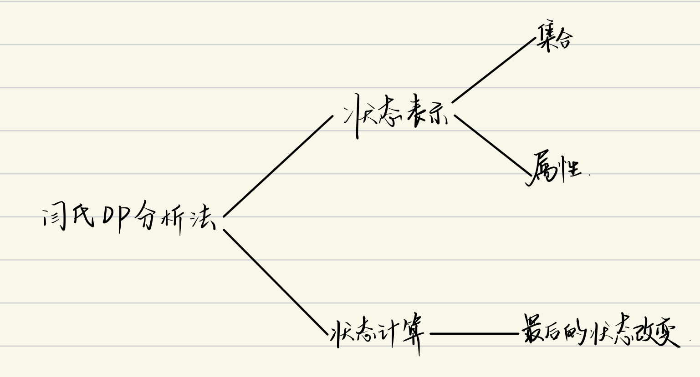
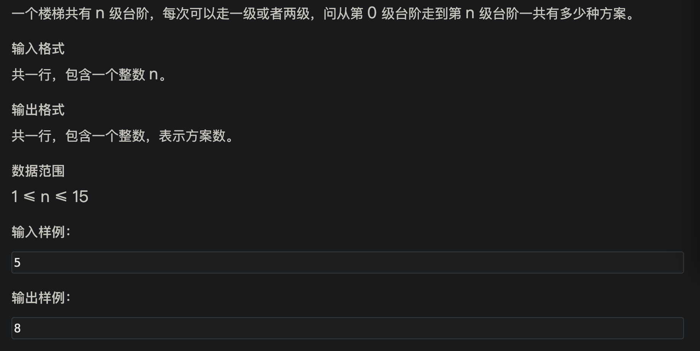
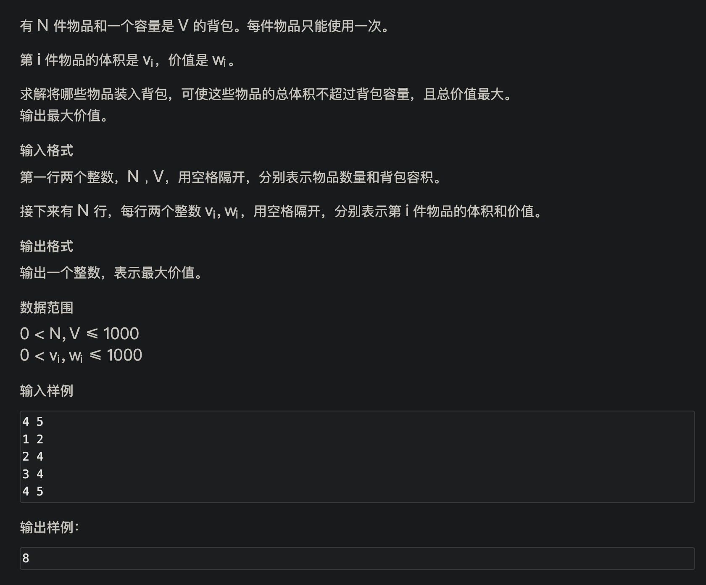
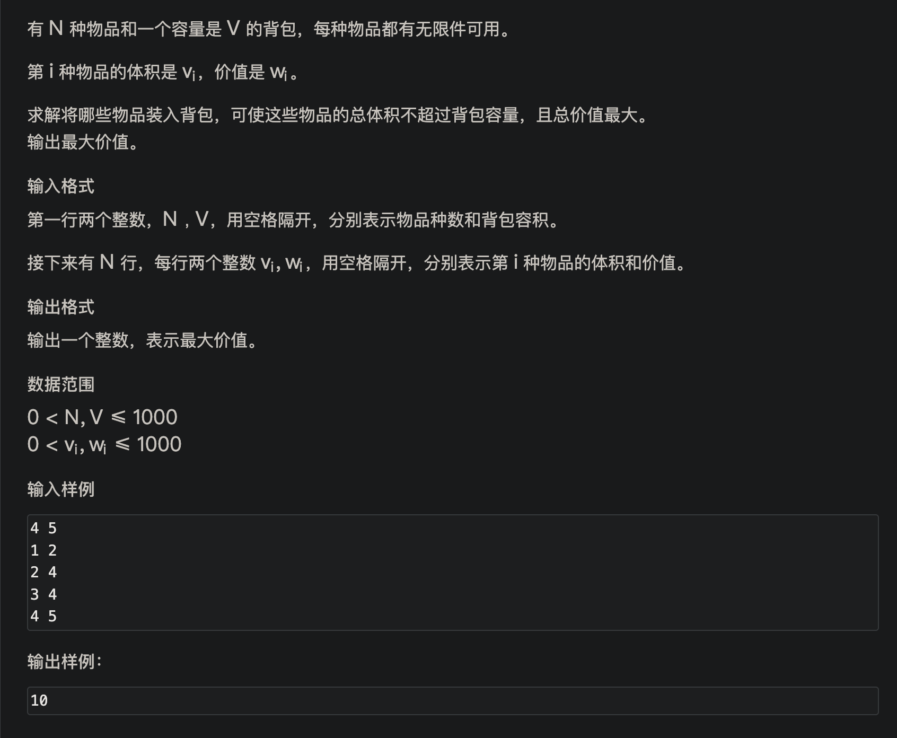

# dp问题

> *__闫氏dp分析法__*

- 分析方法详解：
  闫氏dp分析法将dp问题的分析过程拆分为以下过程

  

  对于一个dp问题来说，我们要找出
  1. 状态表示
     - 集合：我们的问题集合
     - 属性：问题求的（一般是max/min/count）
  2. 状态计算
     - 最后状态的改变 -> 每个状态的递推公式

*__problem 1: [跳台阶](https://www.acwing.com/problem/content/823/)__*

使用闫氏dp分析法分析：
original code:
```c++
#include <iostream>

using namespace std;

const int N = 20;

int dp[N];
int n;

int dp_() {
    for (int i = 3; i <= n; i ++) {
        dp[i] = dp[i - 1] + dp[i - 2];
    }
    return dp[n];
}

int main(void) {
    cin >> n;
    dp[0] = 0;
    dp[1] = 1;
    dp[2] = 2;
    cout << dp_() << endl;
    return 0;
}
```

*__problem 2: [01背包问题](https://www.acwing.com/problem/content/2/)__*

使用闫氏dp分析法：
original code:
```c++
#include <iostream>

using namespace std;

constexpr int V = 1e3 + 10;
int n, m;
int f[V][V * V], v[V], w[V];

int dp() {
    for (int i = 1; i <= n; i ++) 
        for (int j = 1; j <= m; j ++) {
            f[i][j] = f[i][j - 1];
            if (v[i] <= j) f[i][j] = max(f[i][j], f[i - 1][j - v[i]] + w[i]);
        }
    return f[n][m];
}

int main(void) {
    cin >> n >> m;
    for (int i = 0; i < n; i ++) 
        cin >> v[i] >> w[i];
    
    cout << dp() << endl;
    return 0;
}
```

*__problem 3: [完全背包问题](https://www.acwing.com/problem/content/3/)__*

使用闫氏dp分析法：
original code:
```c++
#include <iostream>

using namespace std;

const int N = 10010;

int f[N][N], v[N], w[N], n, m;

int main(void) {
    cin >> n >> m;
    
    for (int i = 1; i <= n; i ++) cin >> v[i] >> w[i];
    
    for (int i = 1; i <= n; i ++)
        for (int j = 1; j <= m; j ++) {
            f[i][j] = f[i - 1][j];
            if (j >= v[i]) f[i][j] = max(f[i - 1][j], f[i][j - v[i]] + w[i]);
        }
            
    cout << f[n][m];
    return 0;
}
//未优化空间的版本

```

- 关于分析结束后的优化问题：

> dp问题的优化大都可以在完成朴素分析之后，通过对代码的等价优化上完成

Return to [index](../../index.md)