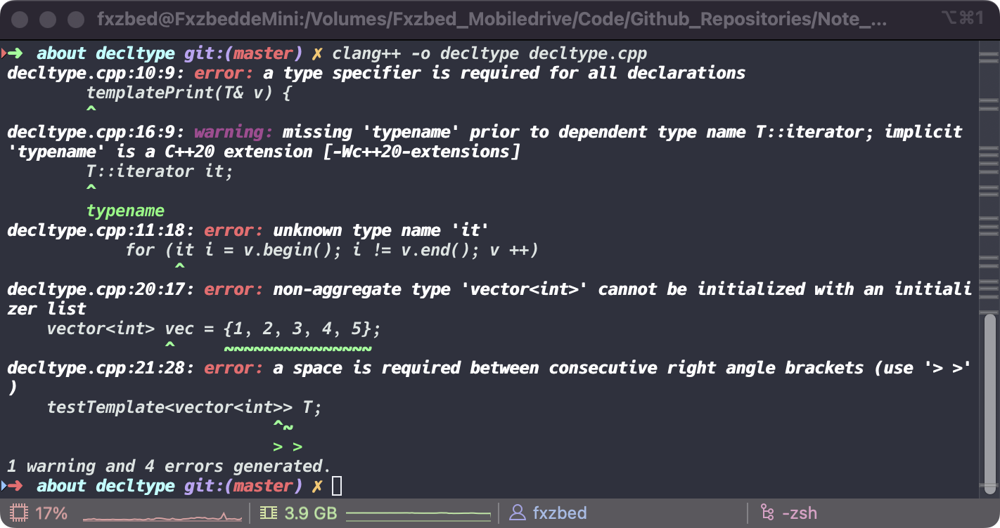
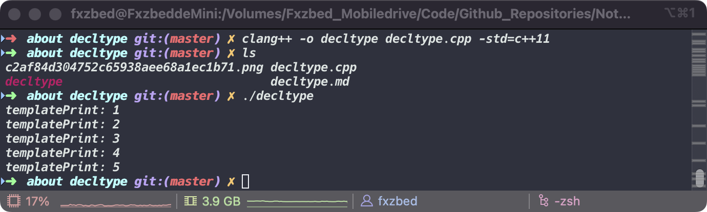

# decltype

> *__example cpp file in [decltype](./decltype.cpp)__*

```c++
//clang++ compiled failed example 
#include <iostream>
#include <algorithm>
#include <vector>

using namespace std;

template <typename T>
class testTemplate {
    public:
        templatePrint(T& v) {
            for (it = v.begin(); it != v.end(); it ++) 
                cout << "templatePrint: " << *it << endl;
        }

    private:
        T::iterator it;
};

int main(void) {
    vector<int> vec = {1, 2, 3, 4, 5};
    testTemplate<vector<int>> T;

    T.templatePrint(vec);
    return 0;
}
```

*__error output image:__*


*__editor can not using typename T to instancing a class__*

*__error in this sentence:__*

```c++
T::iterator it;
```

*__In cpp11 we can use decltype to figure out the type we need__*

<hr>

> *__Right example:__*

```c++
#include <iostream>
#include <algorithm>
#include <vector>

using namespace std;

template <typename T>
class testTemplate {
    public:
        void templatePrint(T& v) {
            for (it = v.begin(); it != v.end(); it ++) 
                cout << "templatePrint: " << *it << endl;
        }

    private:
        decltype(T().begin()) it;
};

int main(void) {
    vector<int> vec = {1, 2, 3, 4, 5};
    testTemplate<vector<int>> T;

    T.templatePrint(vec);
    return 0;
}
```

*__output image:__*


*In this template, we can see you can not pass a right-value to invoke templatePrint() method, if you use perfect reference template to pass any value*

```c++
//perfect version:
#include <iostream>
#include <algorithm>
#include <vector>

using namespace std;

template <typename T>
class testTemplate {
    public:
        template<typename T_>
        void templatePrint(T_&& v) {
            for (it = v.begin(); it != v.end(); it ++) 
                cout << "templatePrint: " << *it << endl;
        }

    private:
        decltype(T().begin()) it;
};

int main(void) {
    vector<int> vec = {1, 2, 3, 4, 5};
    testTemplate<vector<int>> T;

    T.templatePrint(vec);
    return 0;
}
```

*__We can get the same output__*

*__Return to [index](../../../index.md)__*