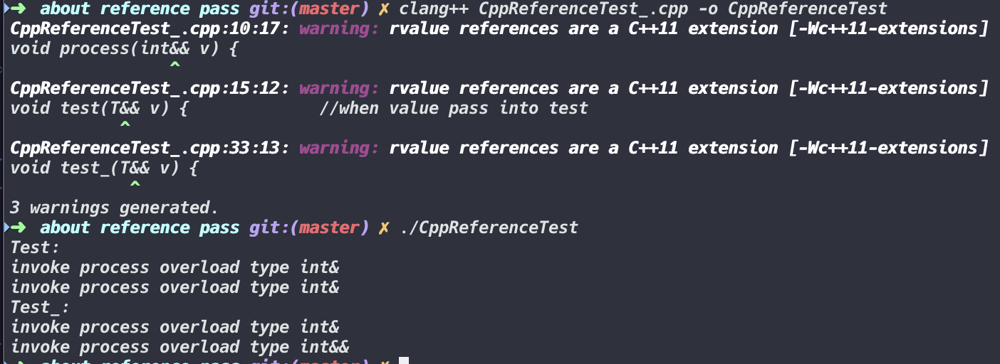

# this is about reference pass in cpp

> example cpp in ./CppReferenceTest.cpp

```c++
#include <iostream>
#include <algorithm>

using namespace std;

void process(int& v) {
  cout << "invoke process overload type int&\n";
}

void process(int&& v) {
  cout << "invoke process overload type int&&\n";
}

template <typename T>
void test(T&& v) {             //when value pass into test 
  process(v);                  
}
/*
 * instancing a template
 * void test(T& && v) {
 *  process(v);
 * }
 *
 * void test(T&& && v) {
 *  process(v);
 * }
 *
 * T& && editor will transform type  ----> T&
 * T&& && editor will transform type ----> T&&
*/

template<typename T>
void test_(T&& v) {
  process(static_cast<T> (v));  //we static_cast turn value type to V
                                //like std::forward
}

int main(void) {
  int i = 0;
  
  cout << "Test:\n";

  test(i);  //we pass a left-value
  test(1);  //we pass a right-value

  cout << "Test_:\n";

  test_(i);
  test_(1);

  return 0;
}
```

- *reference folding*
    
    in this example we can see, when you pass a int& into test function, template will instancing a function like this:

    ```c++
    void test(T& && v) {
        process(v);
    }

    void test(T&& && v) {
        process(v);
    }
    ```

    *__<u>the rule of reference folding</u>__*

    *__but you can not write <mark>typename& && v</mark> or <mark>typename&& && v</mark> in editor!__*

    *__when reference folding have one T&, finall type is left-value reference__*
    
    *__when all reference folding is T&&, finall type is right-value reference__*

- *how to pass a right type into function?*

    ```c++
    template<typename T> 
    void test(T&& v) {
        process(static_cast<T>(v));
    }
    ```

    *__when you pass int& into function editor will instancing a template like this__*

    ```c++
    void test(int& && v) {
        process(static_cast<int&>(v));
    }
    ```

    *__we use static_cast to transform type int&, when you pass int&& this template also work by same way to pass a right type to process__*


> programmer running image

