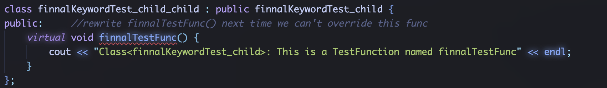
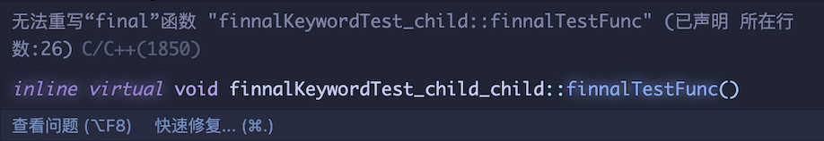

# final_override_Keyword

> example cpp file in [final&&override_Keyword](./final_override_Keyword.cpp)

```c++
#include <iostream>
#include <algorithm>

using namespace std;

class KeywordTest {
private:
    /* data */
public:     //use virtual function let child class can override this function
    virtual void overrideTestFunc() {
        cout << "Class<KeywordTest>: This is a TestFunction named overrideTestFunc" << endl;
        return;
    }
};

class overrideKeywordTest_child : public KeywordTest {
public:     //override overrideTestFunc cross class KeywordTest
    void overrideTestFunc() override {
        cout << "Class<overrideKeywordTest_child>: This is a TestFunction named overrideTestFunc" << endl;
        return;
    }
};

class finalKeywordTest_child : public KeywordTest {
public:     //rewrite finnalTestFunc() next time we can't override this func
    virtual void finnalTestFunc() final {
        cout << "Class<finalKeywordTest_child>: This is a TestFunction named finalTestFunc" << endl;
    }
};


int main(void) {
    return 0;
}
```

*__cpp11 standard add new Keyword named <mark>final</mark> and <mark> override </mark>__*

- *__final__*

    *__We use the final keyword let the virtual function unable to rewirte in child class__*

    *__demo code:__*

    ```c++
    class KeywordTest {
    private:
        /* data */
    public:     //use virtual function let child class can override this function
        virtual void overrideTestFunc() {
            cout << "Class<KeywordTest>: This is a TestFunction named overrideTestFunc" << endl;
            return;
        }
    };

    class finalKeywordTest_child : public KeywordTest {
    public:     //rewrite finnalTestFunc() next time we can't override this func
        virtual void finalTestFunc() final {
            cout << "Class<finalKeywordTest_child>: This is a TestFunction named finalTestFunc" << endl;
        }
    };
    ```

    *__In this demo, class finalKeywordTest_child use final keyword, so you can't rewirte this virtual function called finalTestFunc()__*

    *__final func rewrite test:__*

    

    *__Error image:__*

    

    *__Return to [index](../../../index.md)__*