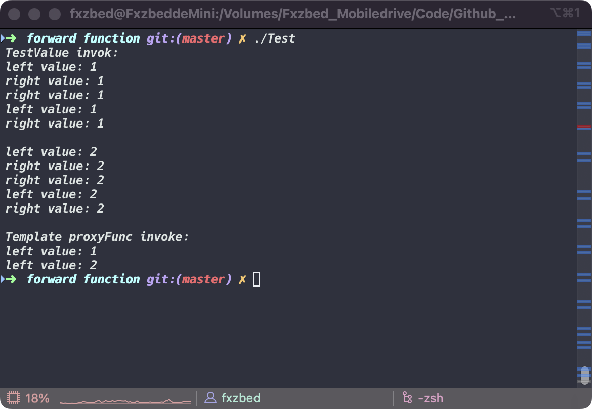

# *__Forward Function__*

> *__example cpp file in [forwardTest](./forwardTest.cpp)__*

*__Use forward to pass the l-value or r-value what you want__*

*__Demo Code:__*

```c++
#include <iostream>
#include <utility>  

using namespace std;

void TestValue(int& a) {
    cout << "left value: " << a << endl;
}

void TestValue(int&& a) {
    cout << "right value: " << a << endl;
}

template <typename T>
void proxyFunc(T&& v) {
    TestValue(forward<T>(v));
}

int main(void) {
    cout << "TestValue invok:" << endl;
    int a = 1;
    int& l_a = a; 
    int&& r_a = 2;
    TestValue(l_a);
    TestValue(1);
    TestValue(forward<int>(l_a));
    TestValue(forward<int&>(l_a));
    TestValue(forward<int&&>(l_a));

    printf("\n");

    TestValue(r_a);
    TestValue(2);
    TestValue(forward<int>(r_a));
    TestValue(forward<int&>(r_a));
    TestValue(forward<int&&>(r_a));

    printf("\n");
    cout << "Template proxyFunc invoke:" << endl;
    proxyFunc(l_a);
    proxyFunc(r_a);
    return 0;
}

```

*__Output image:__*


*__In this case, you might be doubtful about Template proxyFunc invoke: left value: 2__*

*__We pass int&& r_a into proxyFunc why computer print "left value: 2"__*

*__Actually, when you pass r_a, that mean you pass a left value with the type int&&, when template intancing, typename T is int&__*

*__forward function original code:__*

```c++
// 函数原型
template <class T> T&& forward (typename remove_reference<T>::type& t) noexcept;
template <class T> T&& forward (typename remove_reference<T>::type&& t) noexcept;
```

*__demo code 2:__*
```c++
#include <iostream>
using namespace std;

template<typename T>
void printValue(T& t)
{
    cout << "l-value: " << t << endl;
}

template<typename T>
void printValue(T&& t)
{
    cout << "r-value: " << t << endl;
}

template<typename T>
void testForward(T && v)
{
    printValue(v);
    printValue(move(v));
    printValue(forward<T>(v));
    cout << endl;
}

int main()
{
    testForward(520);
    int num = 1314;
    testForward(num);
    testForward(forward<int>(num));
    testForward(forward<int&>(num));
    testForward(forward<int&&>(num));

    return 0;
}
```

*__Another use by this way:__*
```c++
template<typename T>
void print(T& t){
    cout << "lvalue" << endl;
}
template<typename T>
void print(T&& t){
    cout << "rvalue" << endl;
}

template<typename T>
void TestForward(T && v){
    print(v);
    print(std::forward<T>(v));
    print(std::move(v));
}

int main(){
    TestForward(1);
    int x = 1;
    TestForward(x);
    TestForward(std::forward<int>(x));
    return 0;
}
```

*__Return to [Index](../../../index.md)__*